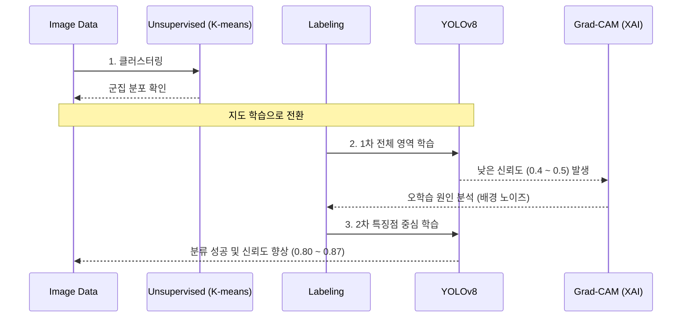

## 🍀 제조 현장에서 사용되는 외형이 매우 유사한 제조 부품(Product A, B)을 대상으로 높은 분류 신뢰도를 확보할 수 있는 자동 분류 모델 구축.

-  클러스터링을 활용한 데이터 분포 분석 및 YOLOv8 모델의 라벨링 전략 수정을 통한 분류 성능 확보.
  

## 파이프라인



## 🔧 기술 스택

| **분류** | **기술 스택** | **주요 역할 및 활용 이유** |
| --- | --- | --- |
| **Language** | **Python** | 데이터 전처리, 모델 학습 및 분석 파이프라인 구축을 위한 메인 언어 |
| **Framework** | **PyTorch** | YOLOv8 및 ResNet50 모델 구현 및 딥러닝 학습 환경 구축 |
| **Feature Extraction** | **ResNet50** | 제조 부품 이미지로부터 고차원 특징 벡터를 추출하여 데이터 분석에 활용 |
| **Visualization** | **t-SNE** | 고차원의 데이터를 2차원으로 축소하여 제품 A/B 간의 군집 중첩 현상을 시각화 |
| **Clustering** | **K-means** | 추출된 특징 데이터를 바탕으로 레이블 없이 부품 간 유사성을 그룹화하여 분포 확인 |
| **Object Detection** | **YOLOv8** | 실시간 객체 탐지 및 정밀 분류를 수행하는 메인 지도 학습 모델로 활용 |
| **Labeling Tool** | **LabelImg** | 바운딩 박스 기반의 학습 데이터셋 라벨링 수행 |
| **Environment** | **Google Colab** | GPU환경을 활용하여 학습 가속화 |

# 📍주요 과정
## 📋 Phase 1: 비지도 학습을 이용한 데이터 탐색

초기 단계에서는 모델이 정답 없이 스스로 데이터의 특징을 잡아낼 수 있는지 분석.

- **주요 작업**
  - ResNet50을 활용해 고차원 특징 추출
  - t-SNE로 차원 축소 및 분포 시각화
  - K-means로 군집화 수행
### **🔍 문제 발견**

- 시각화 결과, 두 군집이 명확하게 나뉘지 않고 **중앙 부분에서 데이터들이 서로 겹쳐있는** 현상 확인.
  

## 📋 Phase 2: 지도 학습 도입과 시행착오

클러스터링 분석을 통해 데이터 분포의 한계를 확인한 후, 정답이 있는 데이터를 모델에게 학습시키고자 YOLO모델을 사용.

- **주요 작업 (전체 객체 라벨링)**
    - **라벨링 전략:** 이미지에서 불필요한 배경을 제거하고, 부품의 전체 외형을 포함하는 바운딩 박스를 그려 모델을 학습.

### **🔍 학습 결과**

- **낮은 Confidence Score:** 제품 A와 B를 어느정도 구분하기는 하나, 평균 **Confidence Score가 30~40%로 상당히 낮게 예측.**
- **클래스 분류 실패:** 제품 A와 B의 미세한 차이를 식별하지 못해 특정 클래스로 확정하지 못하고 예측값이 수시로 변하는 문제가 발생.

### **🔍 원인 분석**

- 배경을 제거하더라도 제품 외형이 거의 비슷해 모델이 클래스를 결정할만한 핵심적인 차이점을 잘 잡아내지 못한다고 판단.
- **모델의 판단 근거 불명확 문제 인지**
    - 단순히 지표만으로는 모델이 실제로 무엇을 근거로 판단하는지 명확하게 알 수 없어서, 어떤 특징을 보고 판단했는지 시각화 할 필요를 느낌.
- 전체 데이터 양도 충분하지 않아 학습을 반복해도 성능 향상에 한계가 있었고, 에폭을 늘렸더니 오히려 혼란이 더 심해지는 현상이 발생. 
  

## 📋 Phase 3: 라벨링 전략 변경으로 성능 개선

부품의 차별화된 핵심 부분만을 강조해 모델을 다시 학습시키고, Grad-CAM으로 모델의 활성화 영역을 확인.

- **주요 작업(라벨링 전략)**
    - 제품 전체가 아닌, 두 제품의 차이를 결정짓는 특징 영역만 타이트하게 **라벨링**을 진행하고 학습을 새롭게 진행.
    - 모델이 공통 영역이 아니라, **제품별 차이**에 집중하도록 유도.
- **데이터 증강**
    - 부족한 데이터는 **밝기, 각도, 노이즈** 등 실제 제조 현장에서 변할 수 있는 요소들을 반영해 증강하고, 파라미터를 조정.
- **Grad-CAM 시각화로,** 모델이 제품의 어떤 특징을 보고 예측을 진행했는지 확인.

## 📝 학습 결과

- **분류 성능 및 안정성 확보:** 라벨링 전략 수정을 통해 모델이 제품 A와 제품 B를 각각 올바른 클래스로 분류하는 데 성공.
- **모델 신뢰도 개선:** 초기 **0.4~0.5 수준**에 머물렀던 평균 신뢰도를 **0.80~0.87 수준까지 개선.**
- **Grad-CAM 기반 분석:** 높은 신뢰도를 기록했지만, **시각화 결과**를 보면 모델이 여전히 **배경이나 그림자 부분**에도 일부 집중하고 있음을 확인.
- ---


## 프로젝트 실행 방법
※ 프로젝트에 사용한 데이터는 기업 내부 자료이기 때문에 실제 데이터셋은 공개하지 않았습니다.


## 파일 구조

```text
dataset/
├── train/          
│   ├── images/
│   └── labels/
├── val/
│   ├── images/
│   └── labels/
├── test/
│   ├── images/
│   └── labels/
└── data.yaml
└── classes.txt         **데이터셋 (Train: 50장, Valid: 12장, Test:6장)**
```


